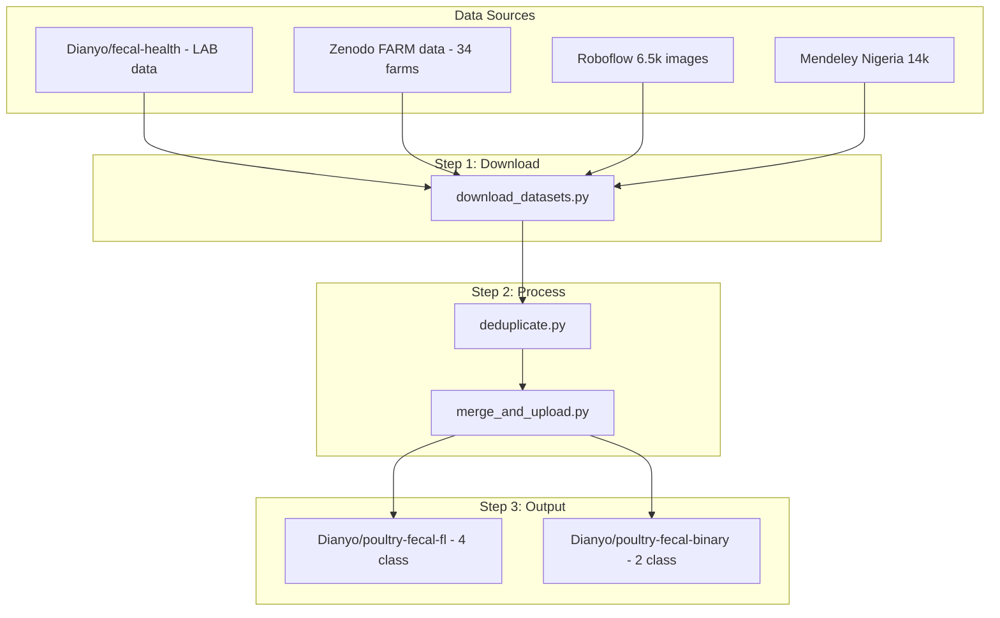

# FlowerTune ViT Poultry Research Implementation

## Current State Analysis

The existing codebase already has:

- Basic Flower setup with ViT-B-16 (frozen backbone, trainable head)
- IID partitioning via `IidPartitioner`
- FedAvg strategy on server
- Basic transforms (resize, crop, normalize)
- Simple accuracy/loss evaluation

**Key files:**

- [vitpoultry/task.py](examples/flowertune-vit-poultry/vitpoultry/task.py) - Model, training, data utilities
- [vitpoultry/client_app.py](examples/flowertune-vit-poultry/vitpoultry/client_app.py) - Flower client
- [vitpoultry/server_app.py](examples/flowertune-vit-poultry/vitpoultry/server_app.py) - Flower server with FedAvg
- [pyproject.toml](examples/flowertune-vit-poultry/pyproject.toml) - Dependencies and config (currently 2 classes, 10 clients)

---

## Implementation Plan

### 0. Environment Setup

Install `uv` package manager and set up project dependencies:

```bash
curl -LsSf https://astral.sh/uv/install.sh | sh
source ~/.bashrc  # or restart shell
cd examples/flowertune-vit-poultry
uv venv && source .venv/bin/activate
uv pip install -e .
```

Update [pyproject.toml](examples/flowertune-vit-poultry/pyproject.toml) to add:

- `scikit-learn` (for metrics)
- `pytorch-grad-cam` (for interpretability)
- `timm` (for MobileViT/Swin models)
- `imagehash` and `Pillow` (for deduplication)
- `roboflow` (for Roboflow API access)
- `huggingface_hub` (for dataset upload)

---

### Phase 0: Data Curation (Major Contribution)

**Goal:** Consolidate multiple poultry fecal image datasets into a single, deduplicated, farm-split dataset on HuggingFace.

#### Data Sources Summary

**Primary Dataset: `Dianyo/poultry-fecal-fl` (4-class) - TO CREATE**


| Source                        | Images      | Classes | Notes                           |
| ----------------------------- | ----------- | ------- | ------------------------------- |
| Zenodo FARM data (4628934)    | 6,812       | 4       | Field-annotated, Tanzania farms |
| Zenodo LAB data (5801834)     | ~1,255      | 4       | PCR-confirmed, high quality     |
| Roboflow disease-images-fecal | ~6,500      | 4       | Via Roboflow API                |
| **Total**                     | **~13,000** | 4       | After deduplication             |


**Note**: The Zenodo dataset does NOT include farm_id metadata. For FL simulation, we use synthetic partitioning (IID or Dirichlet).

**Existing Datasets (verify/use as-is)**


| Dataset                 | Images | Classes | Expected Source                 | Status |
| ----------------------- | ------ | ------- | ------------------------------- | ------ |
| `Dianyo/fecal-health`   | ~1,255 | 4       | Zenodo LAB data (PCR-confirmed) | VERIFY |
| `Dianyo/poultry-health` | ~1,077 | 2       | Mendeley Nigeria                | VERIFY |


**Data Curation Tasks:**

1. **CREATE**: 4-class `poultry-fecal-fl` from Zenodo FARM + LAB data + Roboflow (~13k images)
2. **VERIFY**: Confirm `fecal-health` matches Zenodo LAB data (4-class, PCR-confirmed)
3. **VERIFY**: Confirm `poultry-health` matches Mendeley Nigeria data (binary)

#### New file: `vitpoultry/data_curation/download_datasets.py`

```python
"""Download and organize datasets from multiple sources."""
import os
import requests
import zipfile
from pathlib import Path
from datasets import load_dataset
from tqdm import tqdm

DATA_DIR = Path("raw_data")

def download_zenodo(record_id: str, output_dir: Path):
    """Download dataset from Zenodo API."""
    output_dir.mkdir(parents=True, exist_ok=True)
    url = f"https://zenodo.org/api/records/{record_id}"
    resp = requests.get(url).json()
    
    for file_info in resp["files"]:
        file_url = file_info["links"]["self"]
        filename = file_info["key"]
        filepath = output_dir / filename
        
        if filepath.exists():
            print(f"Skipping {filename} (already exists)")
            continue
            
        print(f"Downloading {filename}...")
        r = requests.get(file_url, stream=True)
        total_size = int(r.headers.get("content-length", 0))
        
        with open(filepath, "wb") as f, tqdm(total=total_size, unit="B", unit_scale=True) as pbar:
            for chunk in r.iter_content(chunk_size=8192):
                f.write(chunk)
                pbar.update(len(chunk))
        
        if filename.endswith(".zip"):
            print(f"Extracting {filename}...")
            with zipfile.ZipFile(filepath, "r") as z:
                z.extractall(output_dir / filename.replace(".zip", ""))

def download_mendeley_nigeria(output_dir: Path):
    """Download Mendeley Nigeria dataset for binary classification."""
    # Mendeley Data DOI: 10.17632/8pnbzpt2k9.1
    # Manual download URL provided
    print("\n=== Mendeley Nigeria Dataset ===")
    print("Download manually from: https://data.mendeley.com/datasets/8pnbzpt2k9/1")
    print(f"Extract to: {output_dir / 'mendeley_nigeria'}")
    output_dir.mkdir(parents=True, exist_ok=True)

def download_huggingface(dataset_name: str, output_dir: Path):
    """Download existing HuggingFace dataset (lab data)."""
    print(f"\nDownloading {dataset_name} from HuggingFace...")
    ds = load_dataset(dataset_name)
    save_path = output_dir / dataset_name.replace("/", "_")
    ds.save_to_disk(str(save_path))
    print(f"Saved to {save_path}")
    return ds

def main():
    DATA_DIR.mkdir(exist_ok=True)
    
    # 1. Download existing HF dataset (= Zenodo LAB data, PCR-confirmed)
    download_huggingface("Dianyo/fecal-health", DATA_DIR / "huggingface")
    
    # 2. Download Zenodo datasets (FARM + LAB data)
    # Record 4628934: FARM data (6,812 images)
    # Record 5801834: LAB data (PCR-confirmed, ~1,255 images)
    print("\n=== Downloading Zenodo AI4D Tanzania Datasets ===")
    download_zenodo("4628934", DATA_DIR / "zenodo_farm")
    download_zenodo("5801834", DATA_DIR / "zenodo_lab")
    
    # 3. Roboflow - manual download required
    print("\n=== Roboflow Dataset (Manual Download) ===")
    print("1. Go to: https://universe.roboflow.com/fecal/disease-images-fecal")
    print("2. Click 'Download Dataset' → Choose 'Folder' format")
    print(f"3. Extract to: {DATA_DIR / 'roboflow'}")
    (DATA_DIR / "roboflow").mkdir(exist_ok=True)
    
    # 4. Mendeley Nigeria (for binary classification experiment)
    download_mendeley_nigeria(DATA_DIR)
    
    print("\n=== Download Summary ===")
    print(f"Data directory: {DATA_DIR.absolute()}")
    print("Next step: Run deduplicate.py after manual downloads complete")

if __name__ == "__main__":
    main()
```

#### New file: `vitpoultry/data_curation/deduplicate.py`

```python
"""Deduplicate images using perceptual hashing."""
import imagehash
from PIL import Image
from pathlib import Path
from collections import defaultdict
import shutil

def compute_phash(image_path: Path, hash_size: int = 16) -> str:
    """Compute perceptual hash for an image."""
    try:
        img = Image.open(image_path).convert("RGB")
        return str(imagehash.phash(img, hash_size=hash_size))
    except Exception as e:
        print(f"Error processing {image_path}: {e}")
        return None

def find_duplicates(image_dir: Path, threshold: int = 5) -> dict:
    """Find duplicate images based on perceptual hash similarity."""
    hash_to_files = defaultdict(list)
    
    for img_path in image_dir.rglob("*.jpg"):
        h = compute_phash(img_path)
        if h:
            hash_to_files[h].append(img_path)
    
    # Group similar hashes (within Hamming distance threshold)
    duplicates = {}
    seen_hashes = set()
    
    for h1, files1 in hash_to_files.items():
        if h1 in seen_hashes:
            continue
        group = list(files1)
        for h2, files2 in hash_to_files.items():
            if h1 != h2 and h2 not in seen_hashes:
                # Compute Hamming distance
                dist = imagehash.hex_to_hash(h1) - imagehash.hex_to_hash(h2)
                if dist <= threshold:
                    group.extend(files2)
                    seen_hashes.add(h2)
        if len(group) > 1:
            duplicates[h1] = group
        seen_hashes.add(h1)
    
    return duplicates

def deduplicate_dataset(input_dir: Path, output_dir: Path):
    """Remove duplicates and copy unique images to output."""
    duplicates = find_duplicates(input_dir)
    
    # Keep first occurrence of each duplicate group
    to_remove = set()
    for h, files in duplicates.items():
        # Keep the one with longest filename (more descriptive)
        files_sorted = sorted(files, key=lambda f: len(f.stem), reverse=True)
        to_remove.update(files_sorted[1:])
    
    print(f"Found {len(to_remove)} duplicate images to remove")
    
    output_dir.mkdir(parents=True, exist_ok=True)
    for img_path in input_dir.rglob("*.jpg"):
        if img_path not in to_remove:
            dest = output_dir / img_path.relative_to(input_dir)
            dest.parent.mkdir(parents=True, exist_ok=True)
            shutil.copy2(img_path, dest)
```

#### New file: `vitpoultry/data_curation/merge_and_upload.py`

```python
"""Merge datasets and upload to HuggingFace."""
import json
from pathlib import Path
from datasets import Dataset, DatasetDict, Image, ClassLabel, concatenate_datasets
from collections import Counter
import re

# 4-class label mapping
LABEL_MAP_4CLASS = {
    "healthy": 0, "Healthy": 0, "HEALTHY": 0,
    "cocci": 1, "Cocci": 1, "coccidiosis": 1, "Coccidiosis": 1,
    "ncd": 2, "NCD": 2, "newcastle": 2, "Newcastle": 2,
    "salmo": 3, "Salmo": 3, "salmonella": 3, "Salmonella": 3,
}
CLASS_NAMES_4 = ["healthy", "cocci", "ncd", "salmo"]

# Binary label mapping (for Mendeley Nigeria)
LABEL_MAP_BINARY = {
    "healthy": 0, "Healthy": 0, "HEALTHY": 0,
    "non-healthy": 1, "nonhealthy": 1, "sick": 1, "diseased": 1,
}
CLASS_NAMES_BINARY = ["healthy", "non-healthy"]

def parse_label_from_path(filepath: Path, label_map: dict) -> int:
    """Extract label from filepath (folder name or filename)."""
    path_str = str(filepath).lower()
    for label_name, label_id in label_map.items():
        if label_name.lower() in path_str:
            return label_id
    return -1

def build_4class_dataset(data_dir: Path) -> DatasetDict:
    """Build 4-class dataset from Zenodo + Roboflow data."""
    from sklearn.model_selection import train_test_split
    records = []
    
    # Process each source directory
    for source_name in ["zenodo_farm", "zenodo_lab", "roboflow"]:
        source_dir = data_dir / source_name
        if not source_dir.exists():
            print(f"Warning: {source_dir} not found, skipping")
            continue
        
        for ext in ["*.jpg", "*.jpeg", "*.png"]:
            for img_path in source_dir.rglob(ext):
                label = parse_label_from_path(img_path, LABEL_MAP_4CLASS)
                if label == -1:
                    continue
                
                records.append({
                    "image": str(img_path.absolute()),
                    "label": label,
                })
    
    print(f"\n4-Class Dataset: {len(records)} images")
    print(f"Label distribution: {Counter(r['label'] for r in records)}")
    
    # Stratified 80/20 train/test split
    labels = [r["label"] for r in records]
    train_records, test_records = train_test_split(
        records, test_size=0.2, stratify=labels, random_state=42
    )
    
    print(f"Train: {len(train_records)}, Test: {len(test_records)}")
    
    train_ds = Dataset.from_list(train_records).cast_column("image", Image())
    test_ds = Dataset.from_list(test_records).cast_column("image", Image())
    
    return DatasetDict({"train": train_ds, "test": test_ds})

def build_binary_dataset(data_dir: Path) -> DatasetDict:
    """Build binary dataset from Mendeley Nigeria data."""
    from sklearn.model_selection import train_test_split
    records = []
    source_dir = data_dir / "mendeley_nigeria"
    
    if not source_dir.exists():
        print(f"Warning: {source_dir} not found")
        return None
    
    for ext in ["*.jpg", "*.jpeg", "*.png"]:
        for img_path in source_dir.rglob(ext):
            label = parse_label_from_path(img_path, LABEL_MAP_BINARY)
            if label == -1:
                continue
            
            records.append({
                "image": str(img_path.absolute()),
                "label": label,
            })
    
    if not records:
        return None
    
    print(f"\nBinary Dataset: {len(records)} images")
    print(f"Label distribution: {Counter(r['label'] for r in records)}")
    
    # Stratified 80/20 split
    labels = [r["label"] for r in records]
    train_records, test_records = train_test_split(
        records, test_size=0.2, stratify=labels, random_state=42
    )
    
    train_ds = Dataset.from_list(train_records).cast_column("image", Image())
    test_ds = Dataset.from_list(test_records).cast_column("image", Image())
    
    return DatasetDict({"train": train_ds, "test": test_ds})

def print_stats(dataset: DatasetDict, class_names: list):
    """Print dataset statistics."""
    print("\n=== Dataset Statistics ===")
    for split_name, split_ds in dataset.items():
        print(f"\n{split_name}:")
        print(f"  Total images: {len(split_ds)}")
        label_counts = Counter(split_ds["label"])
        print(f"  Labels: {dict(label_counts)}")
        print(f"  Label names: {[f'{class_names[i]}: {label_counts[i]}' for i in range(len(class_names))]}")
        print(f"  Unique farms: {len(farm_counts)}")

def verify_existing_dataset(repo_id: str):
    """Verify existing HuggingFace dataset."""
    print(f"\nVerifying {repo_id}...")
    ds = load_dataset(repo_id)
    for split_name, split_ds in ds.items():
        print(f"  {split_name}: {len(split_ds)} images")
        if "label" in split_ds.features:
            label_counts = Counter(split_ds["label"])
            print(f"  Labels: {dict(label_counts)}")

def main():
    data_dir = Path("deduplicated_data")
    
    # Build and upload 4-class dataset
    print("\n" + "="*50)
    print("Building 4-class dataset (Tanzania + Roboflow)")
    print("="*50)
    ds_4class = build_4class_dataset(data_dir)
    print_stats(ds_4class, CLASS_NAMES_4)
    ds_4class.push_to_hub("Dianyo/poultry-fecal-fl", private=False)
    print("\nUploaded to: https://huggingface.co/datasets/Dianyo/poultry-fecal-fl")
    
    # Verify existing datasets match their expected sources
    print("\n" + "="*50)
    print("Verifying existing datasets")
    print("="*50)
    print("\n--- Dianyo/fecal-health (should be Zenodo LAB, 4 classes) ---")
    verify_existing_dataset("Dianyo/fecal-health")
    print("\n--- Dianyo/poultry-health (should be Mendeley Nigeria, binary) ---")
    verify_existing_dataset("Dianyo/poultry-health")

if __name__ == "__main__":
    main()
```

#### Data Curation Workflow




#### Expected Output Dataset Structure

**Primary: `Dianyo/poultry-fecal-fl` (4-class, ~13.5k images)**

```
├── train/
│   ├── image (PIL Image)
│   └── label (ClassLabel: healthy=0, cocci=1, ncd=2, salmo=3)
└── test/
    └── (same schema, held-out farms for evaluation)
```

**Secondary: `Dianyo/poultry-fecal-binary` (2-class, ~14.6k images)**

```
├── train/
│   ├── image (PIL Image)
│   └── label (ClassLabel: healthy=0, non-healthy=1)
└── test/
    └── (same schema, held-out farms)
```

---

### Phase 1: Data Pipeline and Partitioning

**File to modify:** [vitpoultry/task.py](examples/flowertune-vit-poultry/vitpoultry/task.py)

1. **Enhanced Data Augmentation** - Update `apply_train_transforms()`:

```python
transforms = Compose([
    RandomResizedCrop((224, 224)),
    RandomHorizontalFlip(),
    RandomVerticalFlip(),
    RandomRotation(30),
    ColorJitter(brightness=0.2, contrast=0.2, saturation=0.2, hue=0.1),
    ToTensor(),
    Normalize(mean=[0.485, 0.456, 0.406], std=[0.229, 0.224, 0.225]),
])
```

1. **Non-IID Partitioning** - Add `DirichletPartitioner` and farm-based support:

```python
from flwr_datasets.partitioner import DirichletPartitioner, IidPartitioner, NaturalIdPartitioner

def get_dataset_partition(num_partitions, partition_id, dataset_name, partitioning="iid", alpha=0.5):
    """
    Partitioning modes:
    - "iid": Random IID split across clients
    - "dirichlet": Non-IID using Dirichlet distribution (alpha controls heterogeneity)
    """
    global fds
    if fds is None:
        if partitioning == "iid":
            partitioner = IidPartitioner(num_partitions)
        elif partitioning == "dirichlet":
            partitioner = DirichletPartitioner(
                num_partitions=num_partitions,
                partition_by="label",
                alpha=alpha,  # Lower = more heterogeneous
                min_partition_size=10,
            )
        fds = FederatedDataset(dataset=dataset_name, partitioners={"train": partitioner})
    return fds.load_partition(partition_id)
```

**Note**: The Zenodo dataset does not include farm metadata. For FL simulation, we use synthetic partitioning strategies (IID or Dirichlet) to simulate data heterogeneity across clients.

1. **Config updates** in [pyproject.toml](examples/flowertune-vit-poultry/pyproject.toml):
  - Change `num-clients` from 10 to 5 (per research plan: "5-Farm" simulation)
  - Add `partitioning = "iid"` or `"dirichlet"` config
  - Add `dirichlet-alpha = 0.5` config

---

### Phase 2: Model Setup and Baselines

**File to modify:** [vitpoultry/task.py](examples/flowertune-vit-poultry/vitpoultry/task.py)

1. **Config-based model selection** - Following FedPer pattern:

```python
import timm

def get_model(num_classes: int, model_name: str = "vit_b_16"):
    if model_name == "vit_b_16":
        model = vit_b_16(weights=ViT_B_16_Weights.IMAGENET1K_V1)
        in_features = model.heads[-1].in_features
        model.heads[-1] = torch.nn.Linear(in_features, num_classes)
        model.requires_grad_(False)
        model.heads.requires_grad_(True)
    elif model_name == "mobilevit_s":
        model = timm.create_model("mobilevit_s", pretrained=True, num_classes=num_classes)
        # Freeze all except classifier
        for param in model.parameters():
            param.requires_grad = False
        for param in model.head.parameters():
            param.requires_grad = True
    elif model_name == "swin_tiny":
        model = timm.create_model("swin_tiny_patch4_window7_224", pretrained=True, num_classes=num_classes)
        for param in model.parameters():
            param.requires_grad = False
        for param in model.head.parameters():
            param.requires_grad = True
    return model
```

1. **New file:** `vitpoultry/centralized_baseline.py` - Centralized training script:
  - Load full training dataset (no partitioning)
  - Train model for N epochs
  - Evaluate on test set with comprehensive metrics
  - Save best checkpoint
2. **New file:** `vitpoultry/single_farm_baseline.py` - Single-client training:
  - Train on only one partition's data
  - Establishes "lower bound" performance

---

### Phase 3: Federated Learning Engine

**File to modify:** [vitpoultry/server_app.py](examples/flowertune-vit-poultry/vitpoultry/server_app.py)

1. **Add FedProx support** - Config-based strategy selection:

```python
from flwr.serverapp.strategy import FedAvg, FedProx

strategy_name = context.run_config.get("strategy", "fedavg")
if strategy_name == "fedavg":
    strategy = FedAvg(fraction_train=0.5, fraction_evaluate=0.0)
elif strategy_name == "fedprox":
    proximal_mu = context.run_config.get("proximal-mu", 0.1)
    strategy = FedProx(fraction_train=0.5, fraction_evaluate=0.0, proximal_mu=proximal_mu)
```

**File to modify:** [vitpoultry/client_app.py](examples/flowertune-vit-poultry/vitpoultry/client_app.py)

1. **FedProx client-side training** - Add proximal term to trainer:

```python
def trainer_fedprox(net, trainloader, optimizer, epochs, device, global_params, proximal_mu):
    criterion = torch.nn.CrossEntropyLoss()
    net.train()
    for _ in range(epochs):
        for batch in trainloader:
            images, labels = batch["image"].to(device), batch["label"].to(device)
            optimizer.zero_grad()
            # Proximal term
            proximal_term = sum(
                torch.square((local - glob).norm(2))
                for local, glob in zip(net.parameters(), global_params)
            )
            loss = criterion(net(images), labels) + (proximal_mu / 2) * proximal_term
            loss.backward()
            optimizer.step()
```

---

### Phase 4: Evaluation and Interpretability

**File to modify:** [vitpoultry/task.py](examples/flowertune-vit-poultry/vitpoultry/task.py)

1. **Comprehensive metrics** - Update `test()` function:

```python
from sklearn.metrics import classification_report, precision_recall_fscore_support

def test(net, testloader, device, class_names=None):
    all_preds, all_labels = [], []
    net.eval()
    with torch.no_grad():
        for batch in testloader:
            images, labels = batch["image"].to(device), batch["label"].to(device)
            outputs = net(images)
            _, predicted = torch.max(outputs, 1)
            all_preds.extend(predicted.cpu().numpy())
            all_labels.extend(labels.cpu().numpy())
    
    precision, recall, f1, _ = precision_recall_fscore_support(all_labels, all_preds, average='weighted')
    accuracy = sum(p == l for p, l in zip(all_preds, all_labels)) / len(all_labels)
    
    report = classification_report(all_labels, all_preds, target_names=class_names, output_dict=True)
    return {"accuracy": accuracy, "precision": precision, "recall": recall, "f1": f1, "report": report}
```

1. **New file:** `vitpoultry/gradcam_viz.py` - Grad-CAM visualization:

```python
from pytorch_grad_cam import GradCAM
from pytorch_grad_cam.utils.image import show_cam_on_image

def generate_gradcam(model, images, target_layer):
    cam = GradCAM(model=model, target_layers=[target_layer])
    grayscale_cam = cam(input_tensor=images)
    # Save visualization overlays
```

---

## Config Summary for pyproject.toml

**4-class experiment (main):**

```toml
[tool.flwr.app.config]
num-server-rounds = 10
batch-size = 32
learning-rate = 0.001
dataset-name = "Dianyo/poultry-fecal-fl"  # 4-class consolidated dataset
num-classes = 4  # healthy, cocci, ncd, salmo
model-name = "vit_b_16"  # or "mobilevit_s", "swin_tiny"
strategy = "fedavg"  # or "fedprox"
proximal-mu = 0.1
partitioning = "farm"  # "iid", "dirichlet", or "farm" (realistic)
dirichlet-alpha = 0.5
```

**Binary experiment (using existing dataset):**

```toml
[tool.flwr.app.config]
dataset-name = "Dianyo/poultry-health"  # Existing binary Nigeria dataset
num-classes = 2  # healthy, unhealthy
# ... other configs same
```

---

## File Structure After Implementation

```
flowertune-vit-poultry/
├── vitpoultry/
│   ├── __init__.py
│   ├── task.py                 # Model factory, augmentation, partitioning, metrics
│   ├── client_app.py           # Flower client with FedProx support
│   ├── server_app.py           # Server with FedAvg/FedProx selection
│   ├── centralized_baseline.py # NEW: Centralized training script
│   ├── single_farm_baseline.py # NEW: Single-client baseline
│   ├── gradcam_viz.py          # NEW: Grad-CAM visualization
│   └── data_curation/          # NEW: Data curation scripts
│       ├── download_datasets.py
│       ├── deduplicate.py
│       └── merge_and_upload.py
├── pyproject.toml
└── README.md
```

---

## Research Contribution Summary

1. **Data Contribution**: Two curated, deduplicated, farm-annotated poultry fecal datasets:
  - `poultry-fecal-fl`: ~13k images, 4 classes (Zenodo + Roboflow)
  - `poultry-health`: binary classification (Mendeley Nigeria)
2. **FL Simulation**: Synthetic data partitioning using IID or Dirichlet strategies to simulate heterogeneous client data
3. **Non-IID Handling**: Systematic comparison of:
  - FedAvg on IID splits (baseline)
  - FedAvg on farm-based splits (natural heterogeneity)
  - FedProx on farm-based splits (handling Non-IID)
4. **Edge Deployment**: Model efficiency comparison:
  - ViT-B-16 (86M params, high accuracy)
  - MobileViT-S (5.6M params, edge-friendly)
  - Swin-Tiny (28M params, balanced)
5. **Interpretability**: Grad-CAM visualizations proving models focus on disease markers (color changes, texture), not background sawdust
6. **Cross-Region Generalization**: Binary classification experiment on Nigeria data to test model transfer across geographic regions

